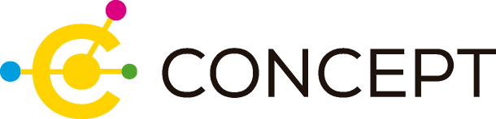

<small><i>This project follows the structure built using the [Common Data Model Builder](https://github.com/cienciadedatosysalud/cdmb), a tool that allows you to create common data models to facilitate interoperability and reproducibility of the analyses.</i></small>


# CONCEPT-STROKE

CONCEPT-STROKE is a study analysing the acute care received by patients with acute ischaemic stroke where the general aim is to estimate the effectiveness and efficiency of the care pathway followed by acute ischaemic stroke patients, using Real World Data (RWD) routinely collected by five Spanish Regional Health Systems.

## CONCEPT Project Coordinator
**[Enrique Bernal-Delgado MD PhD](https://orcid.org/0000-0002-0961-3298)**

Lead Researcher Senior Researcher in Healthcare Services and Policies.

Area of knowledge: Analysis of unjustified variations in healthcare performance. Comparative analysis of health systems. Methodology of research using real-world data.

## Main specific aims:

- To discover the actual care pathway of Acute Ischemic Stroke, from the admission to an emergency room in a public hospital to the appearance of an event of interest after discharge. 
- To compare that care pathway discovered with the theoretical pathway that a patient should follow according to the 
regional Stroke Plans.
- To analyse the impact of specific care interventions within and across care paths, in terms of patients survival.
- To compare the traditional analytical methods with process mining methods in terms of modeling quality, prediction performance and information provided.


## Cohort definition:

The cohort is defined as patients admitted to hospital due to acute ischaemic stroke.

### Inclusion criteria: 

Patients aged 18 years or older admitted to the emergency department (or with an unplanned hospital admission) with a principal diagnosis of acute ischaemic stroke during the study period.

### Exclusion criteria: 

Patients aged 17 years or younger; Patients with a diagnosis of acute haemorrhagic stroke or with other non-specific stroke diagnoses.

## Study period:

From 01-01-2010 until 31-12-2022

## IN ORDER TO RUN THE DOCKER FOLLOW THE NEXT STEPS

### 1-HOW TO RUN
Use the following code snippet to create the container.
```bash
docker pull ghcr.io/cienciadedatosysalud/concept-stroke:latest

docker run -d -p 127.0.0.1:3000:3000 --name concept-stroke-aspire ghcr.io/cienciadedatosysalud/concept-stroke:latest

```
Open your web browser at http://localhost:3000

### 2-Run the analysis

Follow the steps below.
  1. Map your data in the "MAP DATA" tab.
  2. If everything has worked well, in the "RUN ANALYSIS" tab, select the project "CONCEPT-STROKE" and select the script "**analysis_concept.qmd**"
  3. Go to the "OUTPUTS" tab and download the results.

# Authoring

| Surname, name | Affiliation |  ORCID |
|---------------|-------------|------------------------------------------------------------------------------|
| Grupo de Investigación en Ciencia de Datos para Servicios y Políticas de Salud | Instituto Aragonés de Ciencias de la Salud (IACS), Instituto de Investigación Sanitaria de Aragón (IIS) | |
| Royo-Sierra, Santiago | Instituto Aragonés de Ciencias de la Salud (IACS) | https://orcid.org/0000-0002-0048-4370 |
| Estupiñan-Romero, Francisco | Instituto Aragonés de Ciencias de la Salud (IACS) | https://orcid.org/0000-0002-6285-8120 |
| González-Galindo, Javier | Instituto Aragonés de Ciencias de la Salud (IACS) | https://orcid.org/0000-0002-8783-5478 |
| Bernal-Delgado, Enrique | Instituto Aragonés de Ciencias de la Salud (IACS) | https://orcid.org/0000-0002-0961-3298 |

__Project leader: [Bernal-Delgado, Enrique](https://orcid.org/0000-0002-0961-3298)__


# How to contribute
- Repository: https://github.com/cienciadedatosysalud/CONCEPT-STROKE
- Issue tracker: https://github.com/cienciadedatosysalud/CONCEPT-STROKE/issues

# References
- Data Science for Health Services and Policy Research group: https://cienciadedatosysalud.org/en/
- Common Data Model Builder library :https://github.com/cienciadedatosysalud/cdmb
- Analytic Software Pipeline Interface for Reproducible Execution (ASPIRE): https://github.com/cienciadedatosysalud/ASPIRE
- Atlas VPM community in Zenodo: https://zenodo.org/communities/atlasvpm
- Research Object Crate (RO-Crate): https://www.researchobject.org/ro-crate/
- ORCID: https://orcid.org/

[](https://zenodo.org/badge/latestdoi/653146110)
<a href="https://creativecommons.org/licenses/by/4.0/" target="_blank" ></a>

